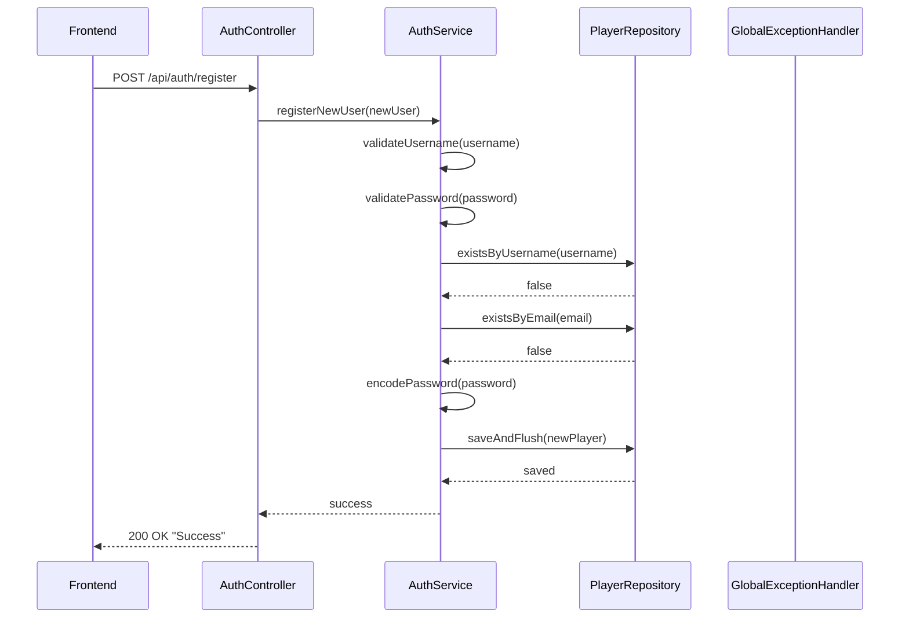
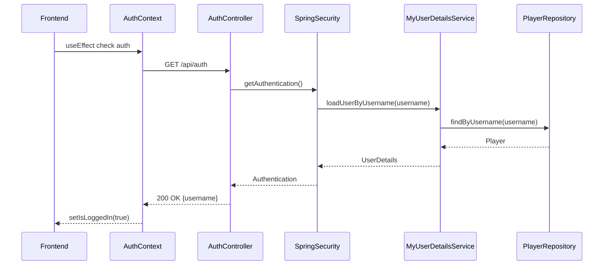
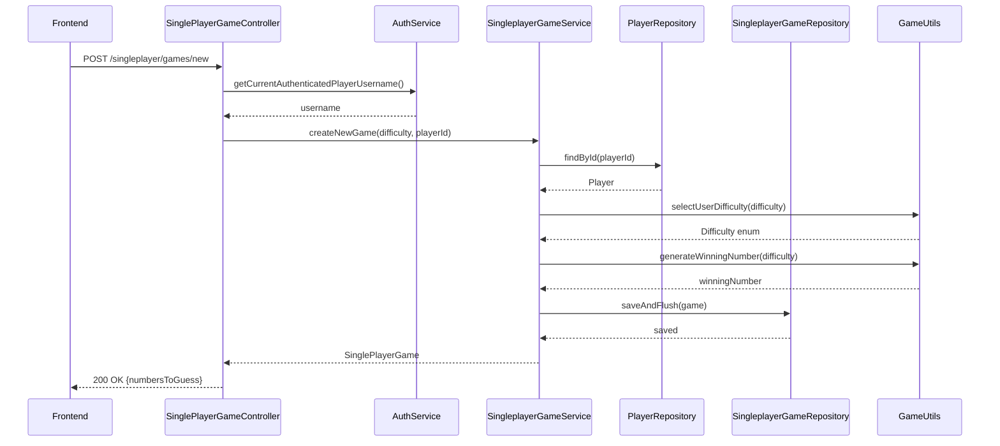
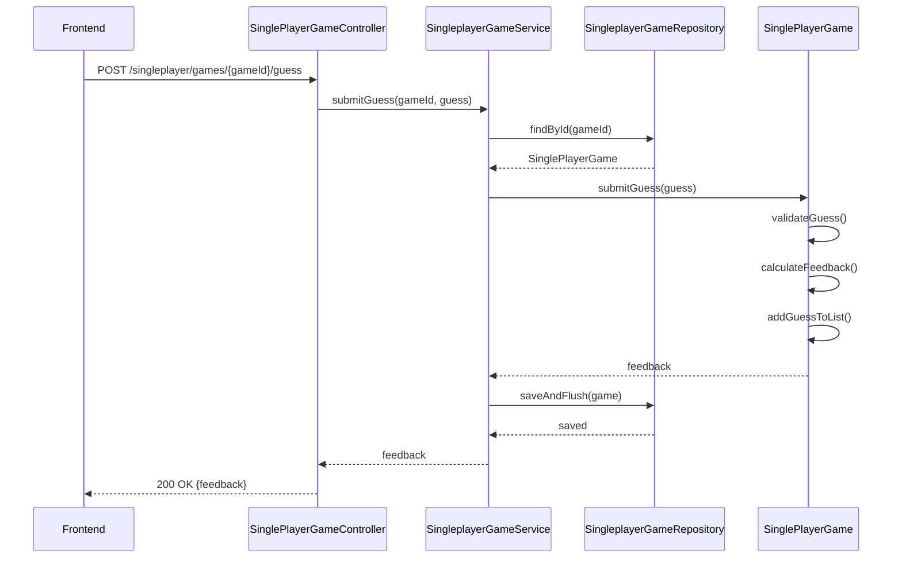
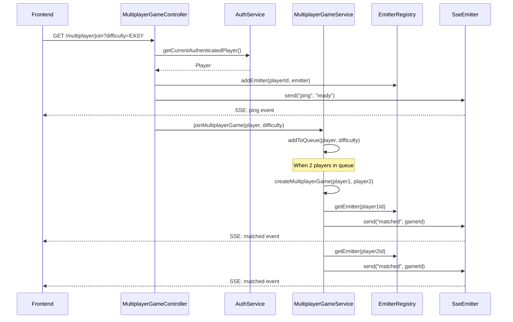
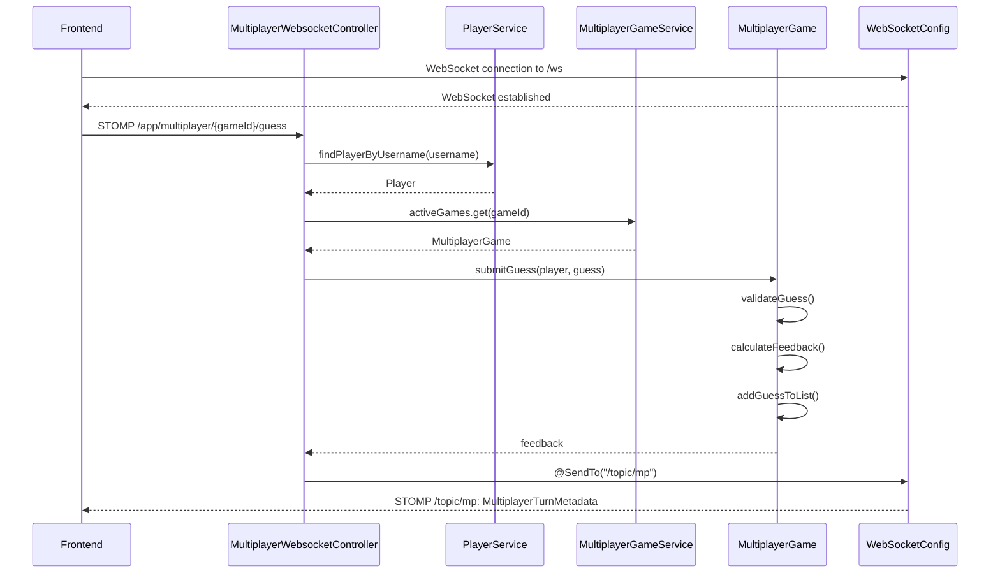
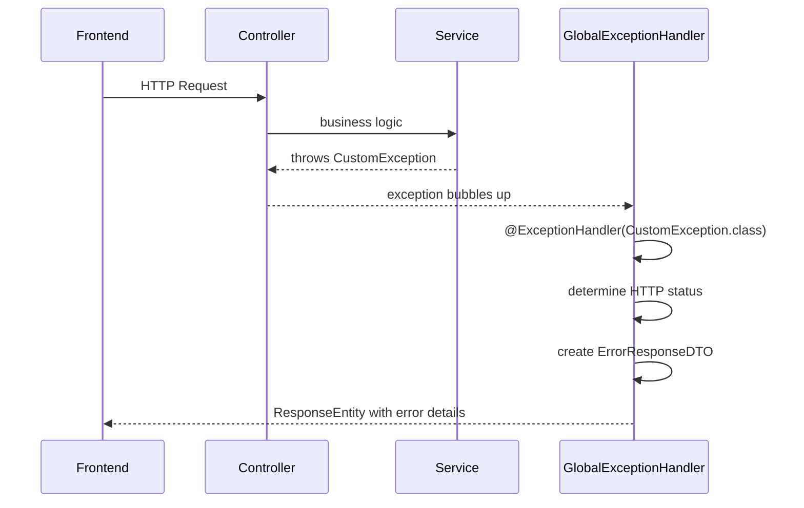
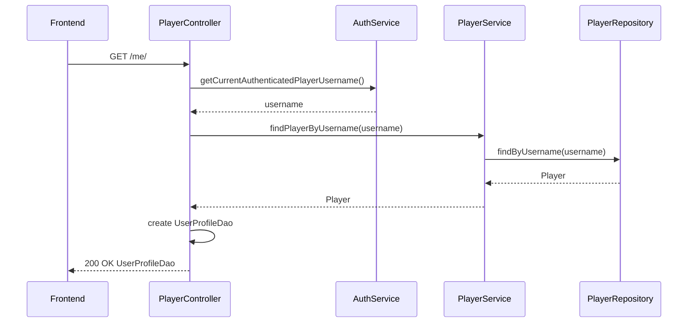

# Mastermind - Reach Apprenticeship Project

Welcome to Mastermind! This is my version of the classic Mastermind game that features both Single and Multiplayer modes. The goal is to guess a secret number combination within 10 attempts, with feedback after every guess. The game features log in, registration, game history, the ability to resume past games, and a queue based match-making system, where users play as a team to solve the secret combination. The backend is built primarily as a Rest API, but switches from HTTP to the Websocket protocol for multiplayer games. 


---

- [🎮 Game Rules](#game-rules)
  - [Example Run](#example-run)
- [🌀 Game Flow](#game-flow)
- [🚀 Getting Started](#getting-started)
  - [Prerequisites](#prerequisites)
  - [Installation & Setup](#installation--setup)
- [🏗️ Architecture Overview](#architecture-overview)
  - [Tech Stack](#tech-stack)
  - [Why Java & Spring Boot](#why-java--spring-boot)
  - [💾 Why PostgreSQL](#why-postgresql)
- [🎮 Game Features](#game-features)
  - [Single Player Mode](#single-player-mode)
  - [Multiplayer Mode](#multiplayer-mode)
    
- [🛠️ Backend Routes & Frontend Pages](#backend-routes--frontend-pages)
- [🏛️ Architecture Patterns](#architecture-patterns)
- [📊 Data Models](#data-models)
  - [Player](#player)
  - [SinglePlayerGame](#singleplayergame)
  - [MultiplayerGame](#multiplayergame)
  - [Enums](#enums)
- [🔧 Services & Controllers](#services--controllers)
- [🌐 Real-time Communication](#real-time-communication)
- [🧪 Testing Strategy](#testing-strategy)
- [🔒 Security Features](#security-features)
- [🚀 Key Achievements](#key-achievements)
- [🔮 Future Enhancements](#future-enhancements)
- [🌱 Personal Growth Milestones](#personal-growth-milestones)


---

## 🎮 Game Rules

- At the start of a game, the computer randomly selects a secret pattern of numbers.
- The length of the pattern depends on the chosen difficulty:
  - **Easy** → 4 digits (0–7)
  - **Medium** → 6 digits (0–8)
  - **Hard** → 9 digits (0–9)
- A player (or team in multiplayer) has **10 attempts** to guess the correct pattern.
- After each guess, feedback is provided:
  - **Correct number** guessed but wrong position
  - **Correct number in the correct position**
  - **Incorrect guess** (no matches)
- Invalid guesses (duplicates, non-numeric input, or wrong length) are rejected and **don’t** count as attempts.
- The game ends with either a **win (correct pattern guessed)** or **loss (attempts used up)**.

### Example Run

Secret: `0 1 3 5`  
- Guess `2 2 4 6` → *All incorrect*  
- Guess `0 2 4 6` → *1 correct number, 1 correct location*  
- Guess `2 2 1 1` → *1 correct number, 0 correct location*  
- Guess `0 1 5 6` → *3 correct numbers, 2 correct location*

> Feedback never reveals **which digits** are correct — only how many are correct.

---

## 🌀 Game Flow

## 1. User Registration Flow



## 2. User Authentication Flow



## 3. Single Player Game Creation



## 4. Single Player Guess Submission



## 5. Multiplayer Game Matchmaking



## 6. Multiplayer Game Guess via WebSocket



## 7. Error Handling Flow



## 8. Player Profile Retrieval



## Architecture Overview

The application follows a layered architecture:

1. **Frontend Layer**: React with TypeScript, handles UI and user interactions
2. **Controller Layer**: Spring Boot REST controllers and WebSocket controllers
3. **Service Layer**: Business logic and orchestration
4. **Repository Layer**: Data access and persistence
5. **Model Layer**: Entities and DTOs
6. **Configuration Layer**: Security, WebSocket, and other configurations
7. **Exception Handling**: Global exception handler for consistent error responses

### Key Technologies:
- **Backend**: Spring Boot, Spring Security, WebSocket/STOMP, JPA/Hibernate
- **Frontend**: React, TypeScript, React Router
- **Communication**: REST APIs, Server-Sent Events (SSE), WebSocket/STOMP
- **Database**: JPA with repository pattern
- **Security**: Form-based authentication with Spring Security

---

## 🚀 Getting Started

### Prerequisites

- **Java 17+**
- **Node.js 18+**
- **PostgreSQL 12+**
- **Maven 3.6+**

### Installation & Setup

#### 1. Clone the Repository
```bash
git clone https://github.com/danj-jo/mastermind-linkedin.git
cd mastermind-linkedin

## 🎮 Game Rules

- At the start of a game, the computer randomly selects a secret pattern of numbers.
- The length of the pattern depends on the chosen difficulty:
  - **Easy** → 4 digits (0–7)
  - **Medium** → 6 digits (0–7)
  - **Hard** → 8 digits (0–7)
- A player (or team in multiplayer) has **10 attempts** to guess the correct pattern.
- After each guess, feedback is provided:
  - **Correct number** guessed but wrong position
  - **Correct number in the correct position**
  - **Incorrect guess** (no matches)
- Invalid guesses (duplicates, non-numeric input, or wrong length) are rejected and **don’t** count as attempts.
- The game ends with either a **win (correct pattern guessed)** or **loss (attempts used up)**.

### Example Run

Secret: `0 1 3 5`  
- Guess `2 2 4 6` → *All incorrect*  
- Guess `0 2 4 6` → *1 correct number, 1 correct location*  
- Guess `2 2 1 1` → *1 correct number, 0 correct location*  
- Guess `0 1 5 6` → *3 correct numbers, 2 correct location*

> Feedback never reveals **which digits** are correct — only how many are correct.

---

## 🌀 Game Flow
## 1. User Registration Flow


## 2. User Authentication Flow


## 3. Single Player Game Creation


## 4. Single Player Guess Submission


## 5. Multiplayer Game Matchmaking


## 6. Multiplayer Game Guess via WebSocket


## 7. Error Handling Flow


## 8. Player Profile Retrieval


## Architecture Overview

The application follows a layered architecture:

1. **Frontend Layer**: React with TypeScript, handles UI and user interactions
2. **Controller Layer**: Spring Boot REST controllers and WebSocket controllers
3. **Service Layer**: Business logic and orchestration
4. **Repository Layer**: Data access and persistence
5. **Model Layer**: Entities and DTOs
6. **Configuration Layer**: Security, WebSocket, and other configurations
7. **Exception Handling**: Global exception handler for consistent error responses

### Key Technologies:
- **Backend**: Spring Boot, Spring Security, WebSocket/STOMP, JPA/Hibernate
- **Frontend**: React, TypeScript, React Router
- **Communication**: REST APIs, Server-Sent Events (SSE), WebSocket/STOMP
- **Database**: JPA with repository pattern
- **Security**: Form-based authentication with Spring Security

  

---

## 🚀 Getting Started

### Prerequisites

- **Java 17+**
- **Node.js 18+**
- **PostgreSQL 12+**
- **Maven 3.6+**

### Installation & Setup

#### 1. Clone the Repository

```bash
git clone https://github.com/danj-jo/mastermind-linkedin.git
cd mastermind-linkedin
### Prerequisites

- **Java 17+**
- **Node.js 18+**
- **PostgreSQL 12+**
- **Maven 3.6+**

### Installation & Setup

#### 1. Clone the Repository
```bash
git clone (https://github.com/danj-jo/mastermind-linkedin.git)
cd mastermind-linkedin
```

#### 2. Database Setup
```bash
# Create PostgreSQL database
createdb mastermind_db

# Update database credentials in src/main/resources/application.properties
spring.datasource.url=jdbc:postgresql://localhost:5432/mastermind_db
spring.datasource.username=your_username
spring.datasource.password=your_password
```

#### 3. Backend Setup
```bash
# Install dependencies and run tests
mvn clean install

# Start the Spring Boot application
mvn spring-boot:run or if you have intellij, there is a run button that comes with every spring boot project.
```
The backend will be available at `http://localhost:8080`

#### 4. Frontend Setup
```bash
# Navigate to frontend directory
cd frontend/mastermind-frontend

# Install dependencies
npm install

# Start development server
npm run dev
```
The frontend will be available at `http://localhost:5173`

## 🏗️ Architecture Overview

### Tech Stack
- **Backend**: Java 17 with Spring Boot 3.5.5
- **Database**: PostgreSQL using JDBC and JPA for persistence
- **API Layer**: RESTful endpoints for core game logic, user management, and singleplayer mode
- **Real-Time Communication**: WebSockets with STOMP protocol for multiplayer messaging and event broadcasting
- **Frontend**: React 19 with TypeScript and Tailwind CSS for a responsive, modern UI
- **Build Tools**: Maven (backend) and Vite (frontend) for fast, modular builds
- **Testing**: JUnit 5 and Mockito for unit and integration testing

### Why Java & Spring Boot?

After my previous REACH project using JavaScript + MongoDB, I chose Java & Spring Boot for several key reasons:

1. **Static Typing**: Java's compile-time type checking prevents runtime errors and enhances code readability
2. **Robust Framework**: Spring Boot provides excellent support for WebSockets, authentication, authorization, and CORS
3. **Enterprise-Grade**: Built-in security features like CSRF protection and role-based authentication
4. **JPA**: JPA allowed me to make queries faster, to put more energy into core game logic. When complex custom queries were needed, I could rely on JPQL. 

### 💾 Why PostgreSQL?

The choice of **PostgreSQL** was driven by the need to manage **complex relationships** between players, games, and guesses:

- **Player ↔ Game Relationships**: Each player can participate in multiple games, and each game can include one or more players (especially in multiplayer mode).  
- **Game ↔ Guesses**: Each game maintains a list of guesses made by players, which allows structured queries and game resumption.  
- **Data Integrity**: Foreign keys and transactions ensure relationships remain consistent.  
- **Efficient Queries**: Indexing and relational tables allow fast retrieval of game history, leaderboard stats, and player performance.  
- **Future Flexibility**: Makes implementing features like leaderboards, friends, or analytics straightforward.

### Backend Routes & Frontend Pages

### Authentication
| Method | Endpoint | Description |
|--------|----------|-------------|
| POST   | `/api/auth` | Log in |
| POST   | `/api/auth/register` | Register |

### Multiplayer
| Method | Endpoint | Description |
|--------|----------|-------------|
| GET    | `/multiplayer/join` | Join a new multiplayer game |
| GET    | `/multiplayer/{gameID}` | Get multiplayer game details |
| WS     | `/multiplayer/{gameID}/guess` | Send guess (WebSocket) |

### Singleplayer
| Method | Endpoint | Description |
|--------|----------|-------------|
| GET    | `/singleplayer/games/new` | Start a new singleplayer game |
| GET    | `/singleplayer/games/{gameID}` | Get singleplayer game details |
| POST   | `/singleplayer/{gameID}/guess` | Submit guess |

### User Profile
| Method | Endpoint | Description |
|--------|----------|-------------|
| GET    | `/me` | Current user info (username, email, stats) |
| GET    | `/me/games` | Games belonging to the current user |

---

## 🌐 Frontend Pages

| Route | Description |
|-------|-------------|
| `/home` | Home page / new game menu |
| `/login` | Login page |
| `/register` | Registration page |
| `/me` | User profile page |
| `/lobby` | Multiplayer waiting room |
| `/team` | Active multiplayer game |
| `/game/{gameID}` | Singleplayer or multiplayer session page |


## 🎮 Game Features

### Single Player Mode
- **Difficulty Levels**: Easy (4 digits), Medium (6 digits), Hard (8 digits)
- **Game Persistence**: Save and resume games
- **Smart Hints**: Automatic feedback on guess accuracy
- **Game History**: Track past games and performance

### Multiplayer Mode
- **Real-time Matchmaking**: Queue-based system with difficulty-specific rooms
- **Live Updates**: WebSocket communication for instant game state updates
- **Turn-based Gameplay**: Structured guessing with player identification
- **Memory Management**: Games stored in memory until completion

## 🏛️ Architecture Patterns

### MVC Pattern Implementation
- **Model**: JPA entities representing game state and user data
- **View**: React components with responsive UI
- **Controller**: RESTful endpoints with WebSocket support

### Layered Architecture
```
┌─────────────────┐
│   Controllers   │ ← REST API & WebSocket endpoints
├─────────────────┤
│    Services     │ ← Business logic layer
├─────────────────┤
│  Repositories   │ ← Data access layer
├─────────────────┤
│   Database      │ ← PostgreSQL persistence
└─────────────────┘
```

## 📊 Data Models

### Core Entities

#### Player
```java
@Entity
public class Player implements UserDetails {
    private UUID playerId;
    private String username;
    private String email;
    private String password;
    private String role; // ROLE_USER, ROLE_ADMIN
}
```
- Implements Spring Security's `UserDetails` for authentication
- Lean design focused on user representation
- Role-based access control integration

#### SinglePlayerGame
```java
@Entity
public class SinglePlayerGame {
    private UUID gameId;
    private Player player;
    private String winningNumber;
    private Difficulty difficulty;
    private List<String> guesses;
    private Result result;
    private boolean isFinished;
    
    public String submitGuess(String guess) {
        // Core game logic with validation
    }
}
```
- Separate guesses table for optimal query performance
- Built-in game logic with state management
- Resume capability with game persistence

#### MultiplayerGame
```java
@Entity
public class MultiplayerGame {
    private UUID gameId;
    private Player player1;
    private Player player2;
    private String winningNumber;
    private List<MultiplayerGuess> guesses;
    private Result result;
    private boolean isFinished;
}
```
- Two-player game structure
- Separate `MultiplayerGuess` entities for player identification
- Memory-based storage for active games

#### Enums
```java
public enum Difficulty { EASY, MEDIUM, HARD }
public enum Result { PENDING, WIN, LOSS }
public enum GameMode { SINGLE_PLAYER, MULTIPLAYER }
```

## 🔧 Services & Controllers

### Service Layer
- **AuthService**: User registration and authentication
- **PlayerService**: Player data management and retrieval
- **SingleplayerGameService**: Single-player game logic
- **MultiplayerGameService**: Multiplayer game management and matchmaking

### Controller Layer
- **AuthController**: Registration and authentication endpoints
- **PlayerController**: User profile and game history
- **SinglePlayerGameController**: Single-player game operations
- **MultiplayerGameController**: Multiplayer game management
- **MultiplayerWebsocketController**: Real-time WebSocket communication


### Exception Handling
custom exceptions with a global exception handler
examples:
- `GameNotFoundException`
- `PlayerNotFoundException`
- `UnauthorizedGameAccessException`
- `GameCreationException`
  

## 🌐 Real-time Communication

### WebSocket Architecture
- **STOMP Protocol**: Simple messaging abstraction over WebSockets
- **Server-Sent Events**: Real-time game state updates
- **Queue Management**: Thread-safe matchmaking system

### Multiplayer Implementation
```java
// Thread-safe queue management
private Map<String, ConcurrentLinkedQueue<Player>> difficultyQueues;

// Emitter management for real-time updates
private Map<String, SseEmitter> activeEmitters;

// WebsocketEventListeners & Channel Interceptors to remove orphaned games; 
```

### Testing Technologies
- **JUnit 5**: Modern testing framework
- **Mockito**: Mocking and stubbing
- **Spring Boot Test**: Integration testing support
- **H2 Database**: In-memory testing database

## 🔒 Security Features

- **Spring Security**: Authentication and authorization
- **CSRF Protection**: Cross-site request forgery prevention
- **Role-based Access**: User permission management
- **Password Encryption**: Secure credential storage
- **CORS Configuration**: Cross-origin request handling

## 🚀 Key Achievements

1. **Real-time Multiplayer**: Implemented WebSocket-based matchmaking system & Server Sent Events to ping users upon match
2. **Robust Architecture**: Clean separation of concerns with layered design
3. **Security Implementation**: Full authentication and authorization system
4. **Performance Optimization**: Efficient database queries and memory management
5. **Session Lifecycle Tracking**: Mapped STOMP sessions to game IDs on connect, and removed stale games on disconnect using interceptors and event listeners.


## 🔮 Future Enhancements

- **Friends System**: Add social features for multiplayer
- **Leaderboards**: Global and personal statistics

## 🌱 Personal Growth Milestones

This project represents significant growth from my previous REACH submission. I explored and applied several new concepts, including:

- **Relational Databases** – Modeling and querying entity relationships to support multiplayer game logic
- **WebSocket Communication** – Building real-time matchmaking and event dispatch using STOMP and SSE
- **Security Fundamentals** – Implementing CSRF protection, SQL injection prevention, and full authentication/authorization flows
- **Thread Safety** – Managing concurrent access with thread-safe structures like ConcurrentHashMap
- **STOMP Protocol** – Intercepting and handling lifecycle events (CONNECT, SEND, DISCONNECT) for session tracking
- **Server-Sent Events** – Using SSE to notify clients and coordinate multiplayer state transitions

The increased complexity pushed me to adopt proper architectural patterns, improve lifecycle visibility, and design for maintainability—skills. I was also able to see the vision come to life, with the creation of the front end. 

---
